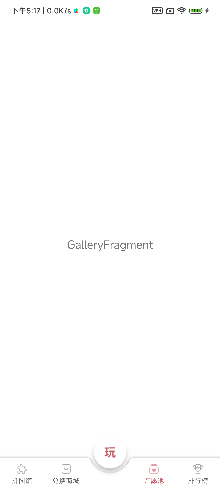

### 运行环境 

##### Android Studio
```
------------------------------------------------------------
Android Studio Giraffe | 2022.3.1 RC 1
------------------------------------------------------------

Build #AI-223.8836.35.2231.10320515, built on June 14, 2023
Runtime version: 17.0.6+0-17.0.6b829.9-10027231 x86_64
VM: OpenJDK 64-Bit Server VM by JetBrains s.r.o.
macOS 14.1
GC: G1 Young Generation, G1 Old Generation
Memory: 2048M
Cores: 16
Registry:
    external.system.auto.import.disabled=true
    debugger.new.tool.window.layout=true
    ide.text.editor.with.preview.show.floating.toolbar=false
    ide.experimental.ui=true

Non-Bundled Plugins:
    Key Promoter X (2023.3.0)
    Dart (223.8977)
    com.herbert.george.dart.extensions (0.0.1+3)
    IdeaVIM (1.9.2)
    com.developerphil.adbidea (1.6.4)
    com.nvinayshetty.DTOnator (V0.997)
    zielu.gittoolbox (212.10.1)
    mobi.hsz.idea.gitignore (4.4.4)
    io.flutter (77.1.1)
------------------------------------------------------------

```

##### Gradle
```
------------------------------------------------------------
Gradle 8.0.2
------------------------------------------------------------

Build time:   2023-03-03 16:41:37 UTC
Revision:     7d6581558e226a580d91d399f7dfb9e3095c2b1d

Kotlin:       1.8.10
Groovy:       3.0.13
Ant:          Apache Ant(TM) version 1.10.11 compiled on July 10 2021
JVM:          11.0.18 (Azul Systems, Inc. 11.0.18+10-LTS)
OS:           Mac OS X 14.1 x86_64

------------------------------------------------------------
```

#####  JAVA
```
------------------------------------------------------------
JDK 
------------------------------------------------------------

openjdk version "17.0.6" 2023-01-17 LTS
OpenJDK Runtime Environment Zulu17.40+19-CA (build 17.0.6+10-LTS)
OpenJDK 64-Bit Server VM Zulu17.40+19-CA (build 17.0.6+10-LTS, mixed mode, sharing)

------------------------------------------------------------
```

### 截图


------


------


------


------



------


